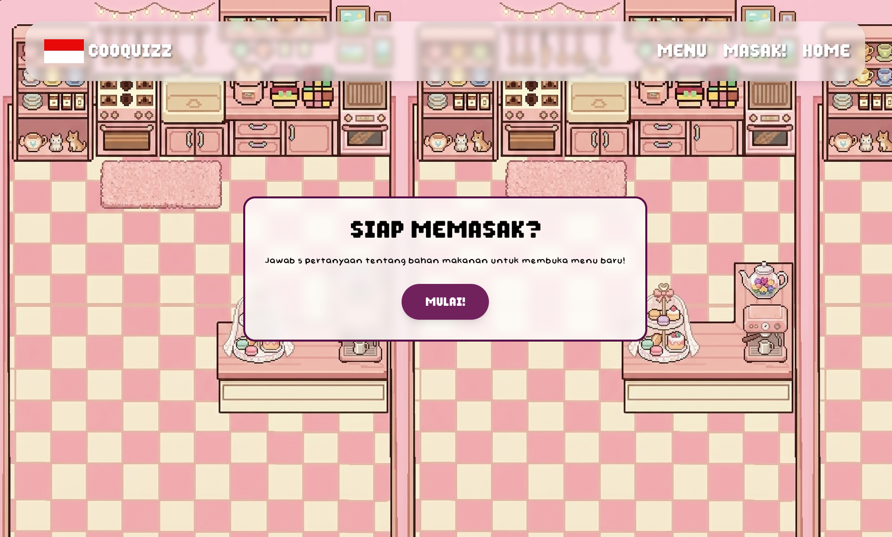

# welcome to MAMADAY! :3
complete quizzes and get new recipes! so i make this website for my mother (and some of my teachers in school)
This is still early development, so maybe the photos are not quite in sync with the recipe, and the recipe is still not perfect, I will make updates in the future.

## what you can do?
For now what you can and need to do is answer the quiz by clicking the 'cook' button then there you will get a random menu, when you arrive at the page/menu you can see the recipe! and from the recipe, you need to scroll and claim the secret code to unlock the letter!

## acknowledgement
### assets
The menu recipes was obtained from Google and photos of menu were taken from Pinterest
### uses of AI
AI helps brainstorming component and explaining/translating svelte original docs, also translating indonesian quiz to english language